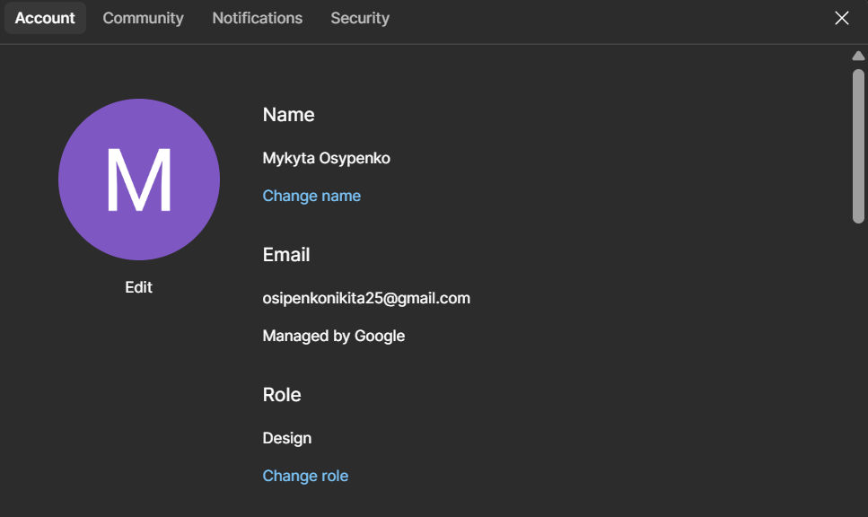
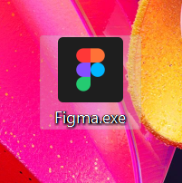
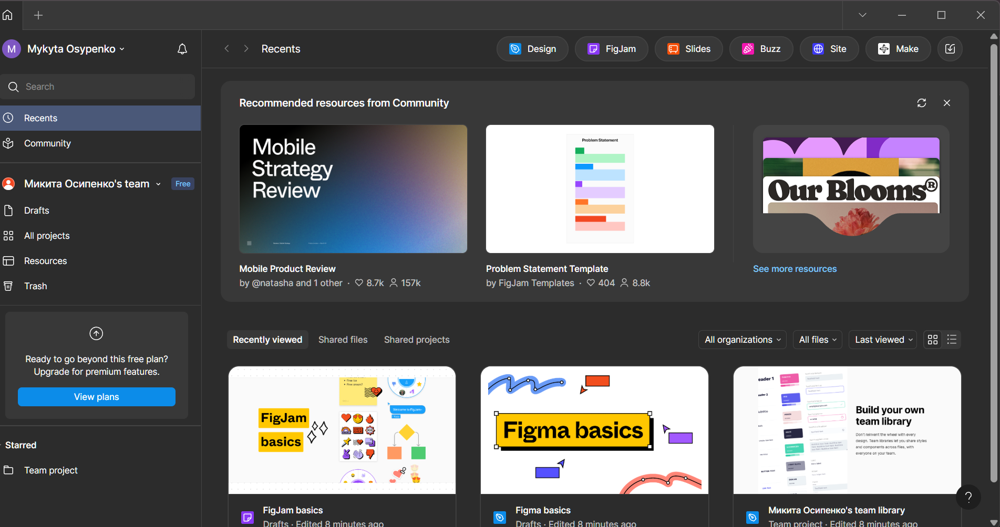

# ПЗ-1 ОГЛЯД І ПОРІВНЯЛЬНА ХАРАКТЕРИСТИКА СЕРВІСІВ ДЛЯ ПРОЕКТУВАННЯ КОРИСТУВАЛЬНИЦЬКИХ ІНТЕРФЕЙСІВ
## Хід роботи
1. Реєстрація на сайті  
Першим етапом був захід на офіційний сайт Figma та створення аккаунту

2. Завантаження десктоп додатку  
Потім на цьому ж сайті я завантажив десктопну версію  

3. Вхід в десктоп додаток  
В самому додатку я зайшов в свій аккаунт

## Висновки
- Завантажив прогаму Figma та зареєструвався на сайті застосунка
- Навчився оформлювати протоколи завдань через чередовище GitHub за допомогою Markdown файлів
