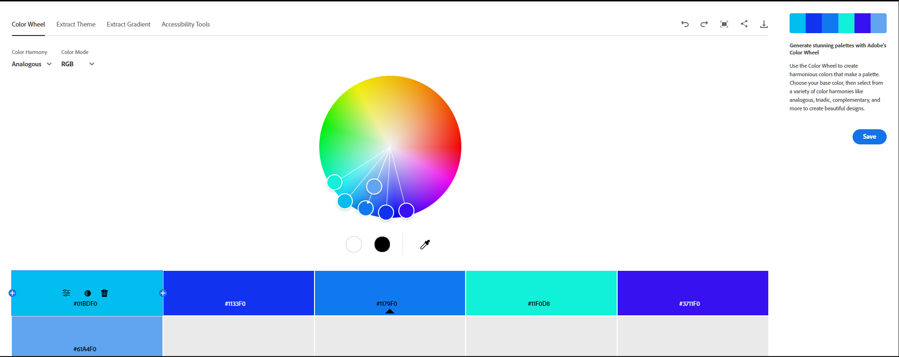
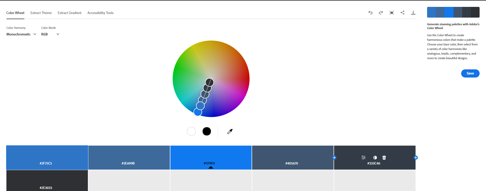
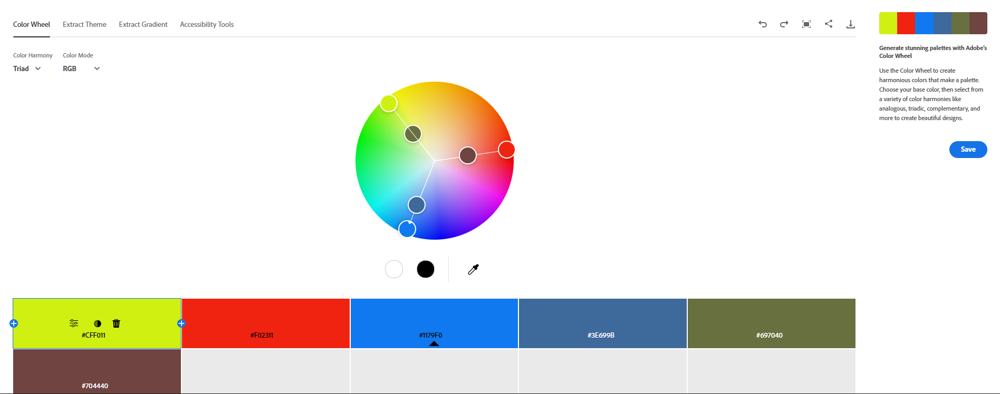
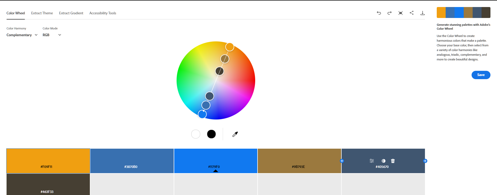
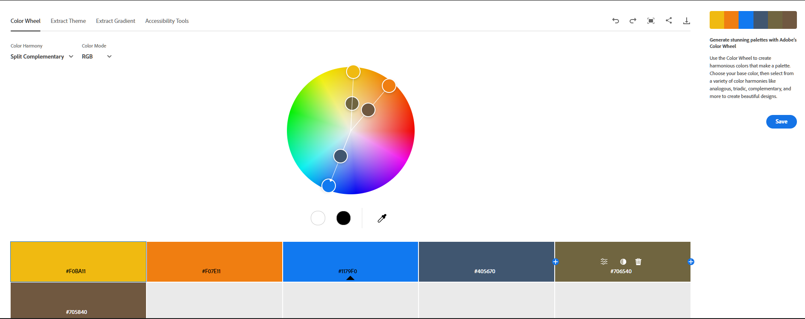
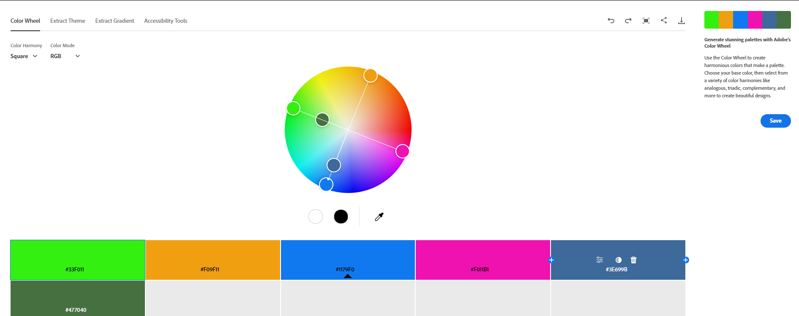
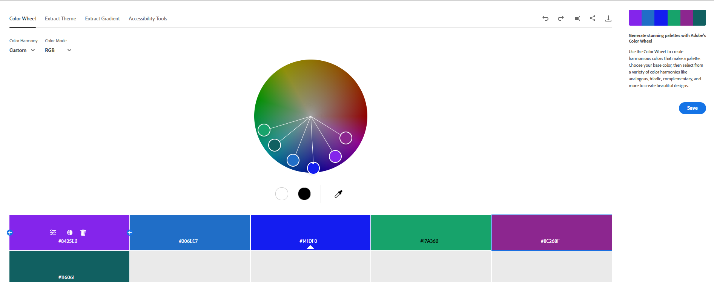
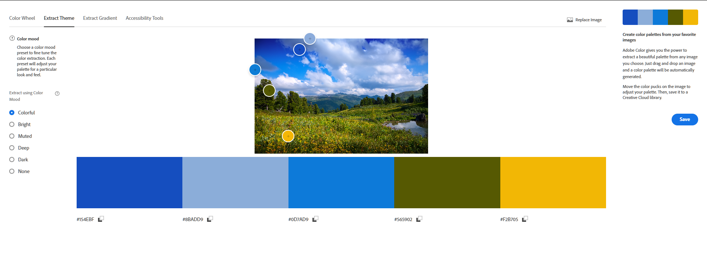
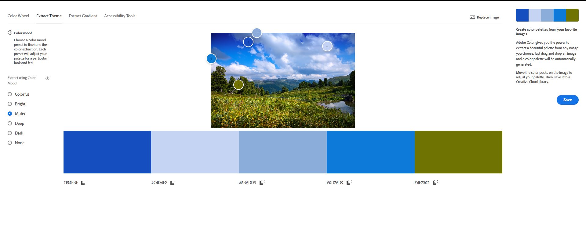
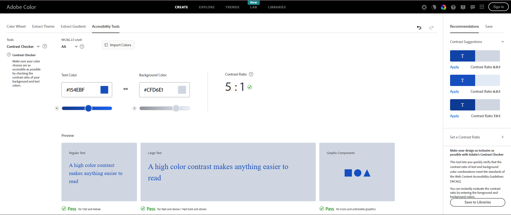

# ПЗ-13 Дослідження кольорових гармоній та інструментів аналізу кольору в Adobe Color
## Теоретична частина  
1. Що таке кольорова гармонія і навіщо вона потрібна в дизайні?
Кольорова гармонія — це розташування кольорів у дизайні найпривабливішим та найефективнішим способом для сприйняття користувачів.  
Потрібна для:  
Створює настрій та атмосферу: Теплі кольори викликають затишок, холодні — легкість, спокійні — довіру, а яскраві — інтерес та енергію.  
Забезпечує цілісність: Гармонійна палітра об'єднує елементи композиції, робить її збалансованою та логічною.  
Керує увагою: Дозволяє виділити важливі елементи (кнопки, акценти) та направляти погляд глядача, не перевантажуючи його.  
Впливає на психологію: Викликає емоційні реакції (спокій від серотоніну, дофамін від яскравого, стрес від хаосу), що важливо для брендів та інтер'єрів.  
Відповідає функціональності: Допомагає створити простір, що відповідає його призначенню (спальня, кухня, додаток) та покращує досвід користувача (UX).  
Уникає хаосу: Без гармонії дизайн стає «хаотичним», «сперечаються» кольори, що візуально стомлює або відштовхує.
Опрацьовані такі типи гармоній:
- Analogous
- Monochromatic
- Triad
- Complementary
- Split Complementary
- Square
- Custom  
## Практична частина  
### Хід роботи  
1. Робота з колірним колесом (Color Wheel)  
Тип: Analogous  
  
Базовий колір: #61A4F0  
Логіка побудови: Усі кольори розташовані поруч один з одним на колірному колі, без різких протилежностей.
Передбачуваний емоційний ефект: Спокій та стабільність.
  
Тип: Monochromatic  

Базовий колір: #1179F0  
Логіка побудови: Монохроматична гармонія ґрунтується на одному базовому кольорі, від якого утворюються всі інші відтінки шляхом зміни: світлоти, насиченості.  
На колірному колі всі точки фактично збігаються в одному секторі, змінюється лише “глибина” кольору, а не його відтінок.
Передбачуваний емоційний ефект: Відчуття порядку та мінімалізму.  
  
Тип: Triad  
  
Базовий колір: #F02311  
Логіка побудови: будується на трьох кольорах, які розташовані на однаковій відстані один від одного на колірному колі.  
Передбачуваний емоційний ефект: Динаміка та енергія.  
  
Тип: Complementary  
  
Базовий колір: #F09F11
Логіка побудови: будується на двох кольорах, розташованих навпроти один одного.  
Передбачуваний емоційний ефект: Рішучість і контрастність.  
  
Тип: Split Complementary  
  
Базовий колір: #F0BA11
Логіка побудови: більш м'який контраст, на відміну від Complementary 
Передбачуваний емоційний ефект: Візуальна різноманітність без хаосу.  
  
Тип: Square  
  
Базовий колір: #33F011  
Логіка побудови: будується на чотирьох кольорах, рівномірно розташованих на колірному колі.  
Передбачуваний емоційний ефект: Енергійність, експресія.  
  
Тип: Custom  
  
Логіка побудови: Власна побудова на основі власних уподобань.  
Передбачуваний емоційний ефект: Власний настрій.  
  
2. Створення палітри зображенням (Extract Theme)
Colorful  
  
Muted

Для інтерфейсу додатку більш підходить Muted палітра, оскільки кольори не ріжуть очі, завдяки приглушоній палітрі.
  
3. Створення градієнту на основі зображення (Extract Gradient)  

  
4. Аналіз контрасту (Accessibility Tools)

## Висновок  
Під час виконання практичної роботи ознайомився із поняттям кольорової гармонії та основними типами гармонії кольорів.  
Навчився використовувати колірне колесо для побудови палітр за різними принципами гармонії.  
Ознайомився із можливостями автоматичного виділення кольорових палітр із зображень та створення градієнтів.  
Навчився перевіряти контрастність кольорових пар відповідно до стандартів доступності.  

