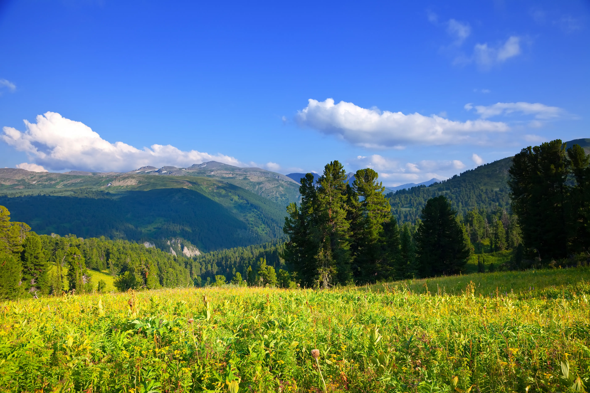
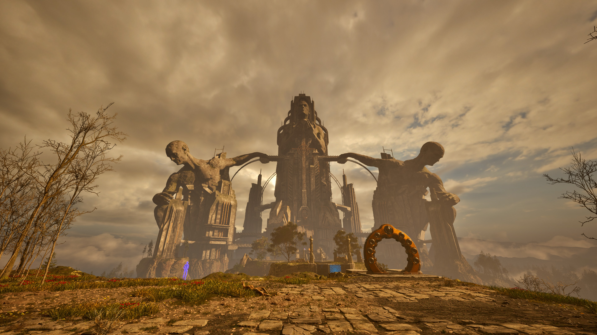

# ПР-14 “Оптимізація зображень за допомогою Squoosh”
## Мета заняття
1. Ознайомити студентів із методами стиснення зображень та їхнім впливом на якість.
2. Навчити визначати оптимальний баланс між якістю та розміром файлу.
3. Ознайомити студентів із різними типами стиснення: без втрат (lossless) та з втратами (lossy).
4. Дослідити вплив зміни розміру на якість зображення та вагу файлу.
5. Навчитися адаптувати зображення для різних цільових застосувань:
- Веб (оптимізація для швидкого завантаження).
- Мобільні пристрої (зменшені розміри, ефективне стиснення).
- Retina-дисплеї (2x, 3x версії для збереження якості).
6. Закріпити навички документування та аналізу результатів у Markdown-форматі у GitHub-репозиторії.
## 1. Початкові зображення
Фото:
Формат - jpg
Вага файлу - 15.7 mb
Розмір - 5616 х 3744
Скріншот:
Формат - jpg
Вага файлу - 1.3 mb
Розмір - 3840 x 2160
Графіка з текстом:
Формат - png
Вага файлу - 54.5 kb
Розмір - 1024 x 459
## 2. Стиснення без втрати якості (lossless)
|        Тип       | Початковий розмір | Lossless стиснення(WebP) | Lossless стиснення(PNG) |
| ---------------- | ----------------- | ------------------------ | ----------------------- |
|        Фото      |     15.7 mb       |             23.3 mb      |         27 mb           |
|      Скріншот    |       1.3 mb      |              5.15 mb     |          7.08 mb        |
|Графіка з текстом |      54.5 kb      |              25.8 kb     |          71.9 kb        |
## 3. Стиснення з втратою якості (lossy)
Фото:  
| Формат | 100% | 75%   | 50%  |
| ------ | ---- | ---   | ---  |
| MozJPEG|17.6mb|2.21 mb|1.42mb|
| WebP   |8.18mb|1.90mb |1.40mb|
| AVIF   |9.41mb|2.65mb |1.19mb|  
  
Скріншот:  
| Формат | 100% | 75%   | 50%  |
| ------ | ---- | ---   | ---  |
| MozJPEG|3.35mb|618kb  |363kb |
| WebP   |2.04mb|506kb  |363kb |
| AVIF   |1.96mb|728kb  |325kb |
  
Графіка з текстом:  
| Формат | 100% | 75%   | 50%  |
| ------ | ---- | ---   | ---  |
| MozJPEG|62.1kb|16.4kb |12.1kb|
| WebP   |21.7kb|8.73kb |7.17kb|
| AVIF   |17.5kb|7.11kb |4.30kb|  
## 4. Оптимізація розміру відповідно до цільового використання
Фото:  
| 1200 px | 600 px | Retina   |
| ------  | ------ | -------  | 
| 1.21mb  | 322kb  | 6.22mb   | 

Скрінщот:  
| 1200 px | 600 px | Retina   |
| ------  | ------ | -------  | 
| 715kb   | 214kb  | 13.8mb   | 

Графіка з текстом:  
| 1200 px | 600 px | Retina   |
| ------  | ------ | -------  | 
| 87.2kb  | 42.8kb | 173kb    | 
## 5. Візуальний аналіз та висновки
Фото  
Оригінал  
  
WebP 75%  
  
Скріншот  
  
WebP 75%  
  
Графіка з текстом  
  
WebP 75%  

## Висновок
Ознайомився із методами стиснення зображень та їхнім впливом на якість.Навчився визначати оптимальний баланс між якістю та розміром файлу.Дослідив вплив зміни розміру на якість зображення та вагу файлу.

