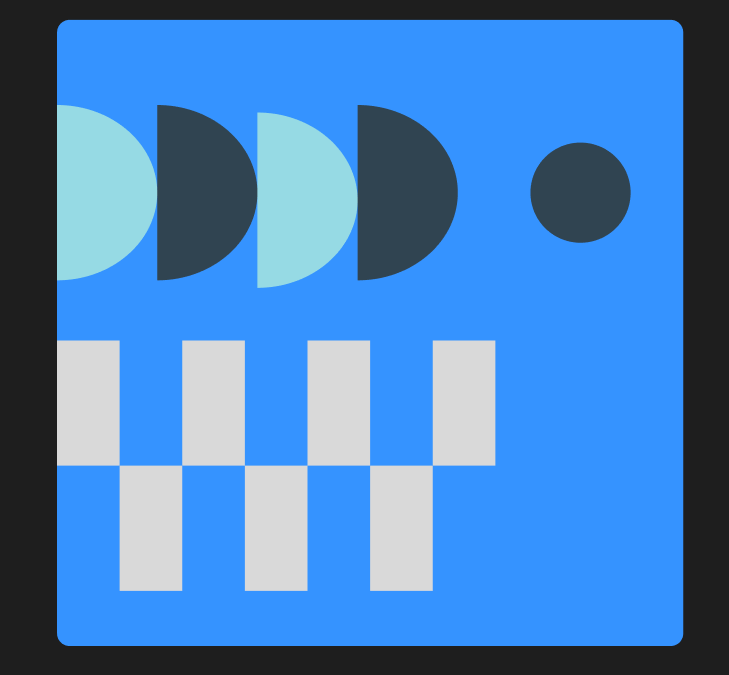

# ПЗ-3 Робота з простими формами та їх властивостями у Figma. Створення геометричного візерунку.Частина 2
## Хід роботи
1. Створення фрейму  
У Figma я створив фрейм розміром 500х500 px, який використовується як основа для візерунку та використовуючи Fill надав йому колір.
2. Створення фігур  
Після налаштування фрейму, у ньому почав створювати прості геометричні фігури, прямокутники та коло та розтошовувати відповідно до прикладу.  
Для створення півкола використовував поєдання прямокутника й кола, та інструмент Substract.  
3. Надання кольорів
Для кола та півколів надав кольори відповідно до прикладу, прямокутники за замовчуванням були білими.
4. Результат  
  
## Висновки  
- Створив фрейм розміром 500х500 px;
- Заповнив фрейм простими геометричними фігурами та півколами, які були створені інструментом Substract;
- Заповнив фрейм та фігури кольорами;
- Навчився створювати візерунки, використовуючи фрейм як основу;
- Навчився комбінувати фігури для створення візерунку
