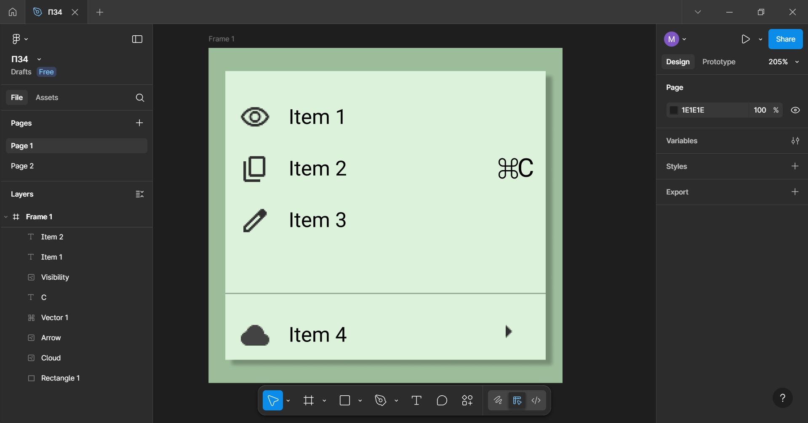
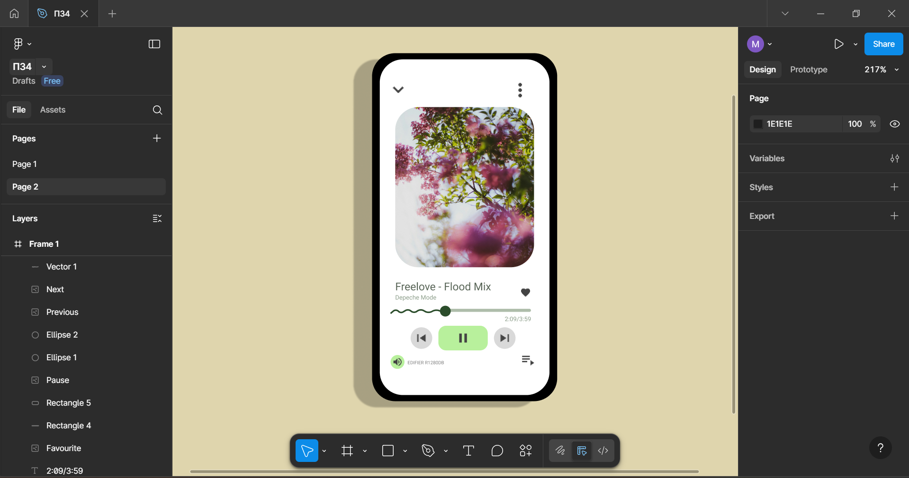

# ПЗ-4 Фрейми, групи і секції у Figma
## Хід роботи
1. Виконання завдання Basic
Для завдання Basic був створенний Frame, на якому потім був створенний прямокутник, на який додавались та розміщались іконки з Google Fonts  
Біля кожної іконки додали текст з шрифтом Roboto.

2. Виконання завдання Medium  
Для завдання Meduim було створенно 2 прямокутника, один з яких відкивав тінь, за допомогою Drop Shadow, а на другому розміщувались елементи управління.
Картинка для альбому була взята зі сайту unsplash.com, іконки також були взяті з Google Fonts, а для тексту було використано шрифт Roboto.
Для полоски, що показує, скільки вже пройшло з початку музики, був використанний інструмент Pen

## Висновки  
На практиці я:  
- використовував картинки з різних джерел у середовищі Figma
- працював з текстом та його шрифтами
- створював вектори за допомогою інстурмента Pen  
Навчився:  
- застосовувати ресурси зі сторонніх джерел
- структуризувати елементи дизайну
- працювати з текстом  
Посилання на роботу
https://www.figma.com/design/wtWyLyYNmGuVLcfhpT3G4T/%D0%9F%D0%974?node-id=3-9&p=f&t=QExoz6VAdOakRaYh-0
