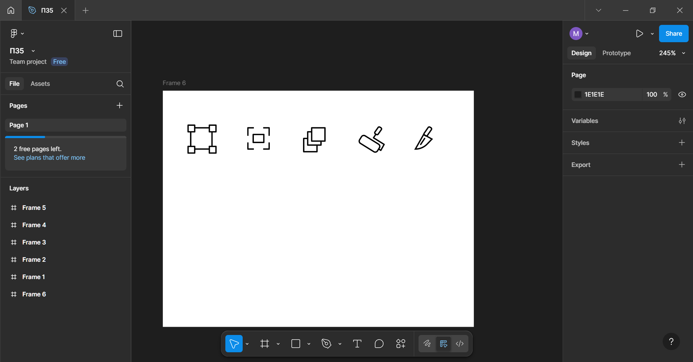

# ПЗ-5 Криві Безьє, векторні об'єкти  у Figma. Створення векторних значків (іконок).
## Хід роботи
1.Створення фреймів  
На початку для іконок було створено 5 фреймів, розміром 24х24.  
2. Створення іконок  
Потім кожна іконка була створена виключно інструментом Pen для малювання кривих Безьє.  
Також для округлення кутів було використано Corner Radius, а також Stroke для округлення кінців відрізків
## Результат  
  
## Висновок  
На практиці я:  
- використовував інструмент Pen для малювання кривих Безьє;
- створив 5 іконок у border-стилі;
Навчився:  
- закріпив навичики використання інструмента Pen;
- робити іконки у border-стилі;  
## Посилання на роботу  
https://www.figma.com/design/yYwOeq8BF0owxgpeBrJMQL/%D0%9F%D0%975?node-id=0-1&p=f&t=KiDhUzJ2hvuMhH3v-0
