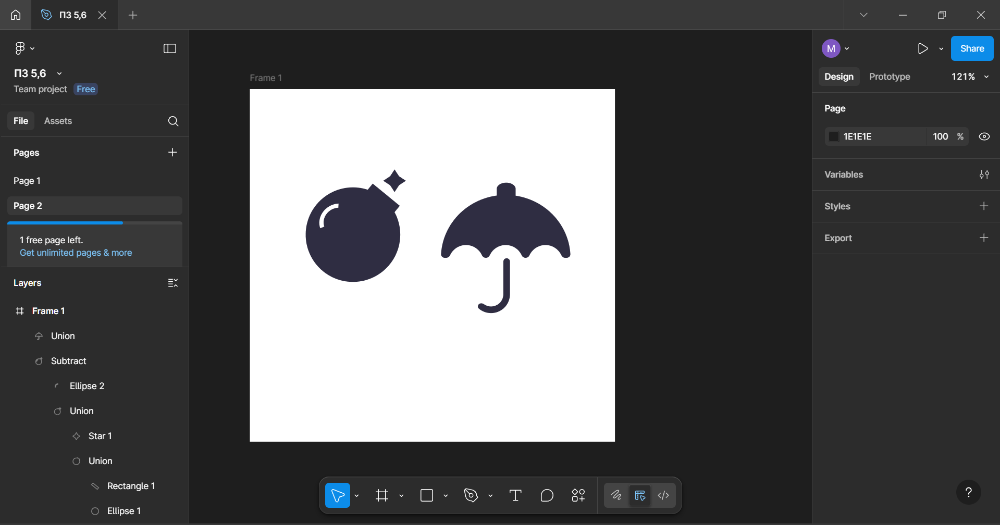

# ПЗ-6 Булеві групи і флетен у figma  
## Хід роботи  
1. На початку було обрано іконки бомби та зонтика для створення.
2. Далі у Фігмі було створенно frame для праці.
3. Для створення бомби було створенно Elipse та Rectangle, які були об'єднані за допомогою Union.Зірочка була створенна через вбудованний інструмент Star, та була об'єднана з бомбою через Union.
Блік було створенно через Elipse з Arc, потім було використано Subtract, для того, щоб блік був прозорий.
4. Для створення зонтику було створенно напів коло, яке за допомогою 3-х малих кіл, rectangle та булевих груп union та substract, щоб отримати форму верхної частини.
Ручка була створена за допомогою еліпса та прямокутника з закрученими вуглами, та булевою групою Union  
## Результат  
   
## Посилання на роботу  
https://www.figma.com/design/yYwOeq8BF0owxgpeBrJMQL/%D0%9F%D0%97-5-6?node-id=17-3&t=e3gK5P5NOFZ3gSf3-0
