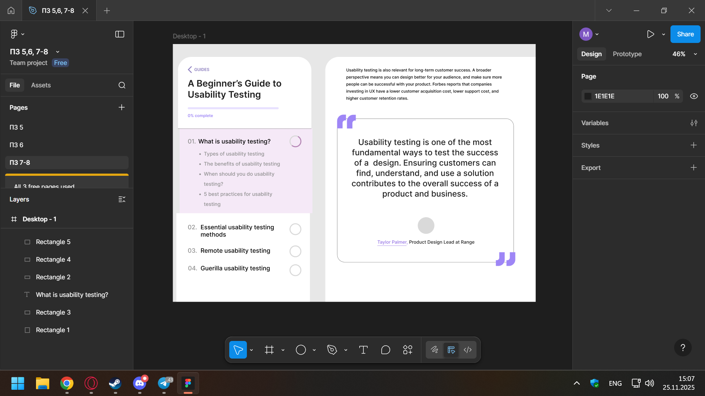

# ПЗ-7-8 Типографіка в дизайні інтерфейсів
## Хід роботи
1. Опрацювання теоретичного матеріалу  
Перед початком виконання практичного завдання, було опрацьовано теоретичний матеріал з файлу "Типографіка"  
2. Виконання практичного завдання  
Було відтворено макет сторінки з практичнго завдання, який демонструє типографіку в дизайні інтерфейсів.
Для побудови макету на початку було створено основу, у вигляді фрейму на якому було створено декілька прямокутників, з різним градусом кутів та кольором.  
Потім додав текст, з різними розміром, відстаню між рядками за допомогою Line height та кольором.  
Кола були створені за домогою двох еліпсів та булевої функції Subtract.  
Для створення лапок використовувався інструмент Pen.
## Результат  
  
## Висновок  
 Навчився працювати з текстом, використовуючи різні кольори, розміри та інтервали між рядками.
[Посилання на роботу у Figma](https://www.figma.com/design/yYwOeq8BF0owxgpeBrJMQL/%D0%9F%D0%97-5-6--7-8?node-id=31-2)
