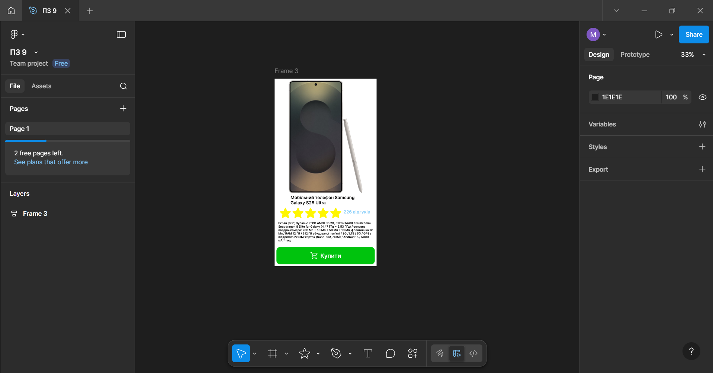

# ПЗ-9 Функція Auto layout у Figma  
## Хід роботи  
1. Опрацювання теоретичного матеріалу
Ознайомися з теоритичною частиною Auto layout та його функціями.
2. Виконання практичного завдання
Створив картку смартфона Samsung Galaxy S25 Ultra, використовуючи Auto layout.
Фон зі зображення смартфону було прибрано за допомогою сайту [remove bg](https://www.remove.bg/).  
Було створено фрейм з Auto layout до якого було додане зображення.Він виступає основним фреймом.
Зірки з відгуками це окремий фрейм з Auto layout, який було додано до основного.
Кнопка це також окремий фрейм, з текстом та іконкою та Auto layout.
## Результат  
  
## Висновок  
Навчився працювати з Auto layout, створюючи картки товару з текстом, зображенням та іконками.  
[Посилання на роботу у Figma](https://www.figma.com/design/7SX5hSaia299eeayxySSp9/%D0%9F%D0%97-9?node-id=0-1&p=f&t=5dHOZhn00pjrbjXq-0)
